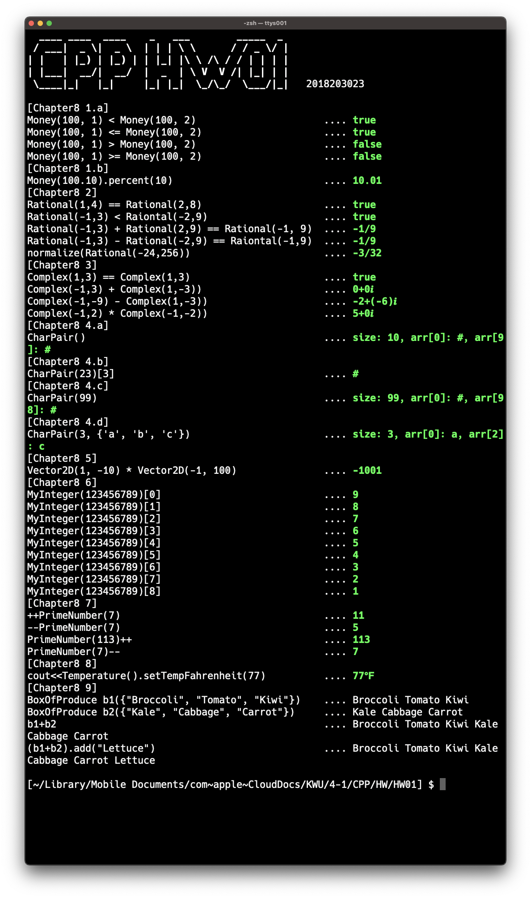

## Absolute C++ 6th edition Programming Projects

[Absolute C++ 6th edition](https://www.amazon.com/Absolute-C-6th-Walter-Savitch/dp/0133970787) 각 챕터의 연습 문제(Programming Project) 코드

### contents

* HW01
    * [Chapter 8](https://github.com/mingeun2154/AbsoluteCPP/tree/main/HW01)
    * [Chapter 9](#)

### execute test

Chapter 8, 9 연습문제 테스트 실행
```shell
$ git clone https://github.com/mingeun2154/AbsoluteCPP
$ cd HW01
$ make
$ ./exe
```
결과


